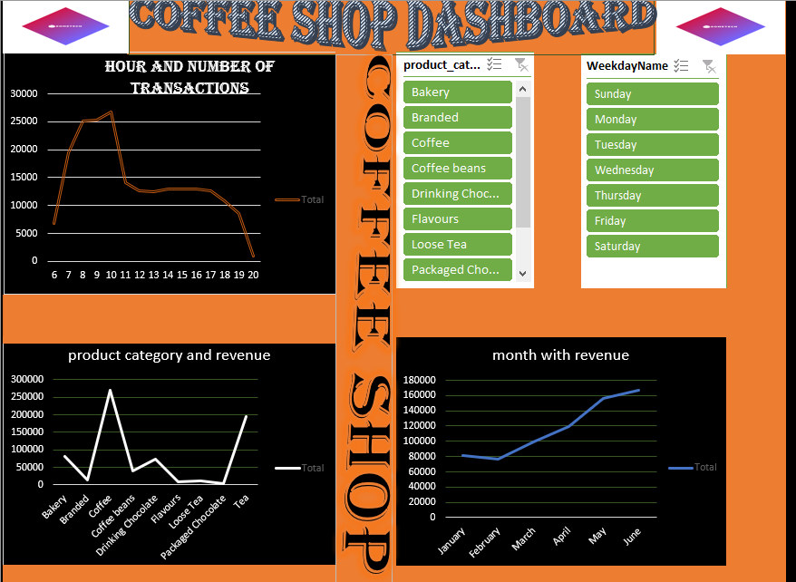

# Coffee Shop Sales Analysis

## Introduction
### 
In today’s competitive coffee industry, gaining a deep understanding of customer purchasing behavior is essential for driving sales and enhancing operational efficiency. This project analyzes transaction data from three coffee shop locations in New York City to uncover key patterns, trends, and business opportunities. By transforming raw sales data into an interactive, user-friendly dashboard, the project provides franchise owners with actionable insights to support data-driven decision-making and strategic growth.

## Problem Statement
### 
How can a coffee shop franchise effectively analyze sales data across multiple locations to gain clear insights into customer preferences, peak sales periods, and best-performing products?
Currently, the lack of a centralized analytics system makes it difficult to optimize inventory, staffing, and marketing strategies. This project addresses that challenge by leveraging data analytics to reveal key trends and drive operational improvements.

## Project Goal
### 
The goal of this project is to transform raw transaction data into a clear and interactive dashboard that highlights customer purchasing behavior, sales trends, and product performance across three coffee shop locations in New York City. The dashboard will enable franchise owners to make data-driven decisions that enhance efficiency, optimize resources, and boost profitability.

## Tools Used
### 
- Microsoft Excel – Data cleaning and transformation

- Pivot Tables – Summary statistics and trend analysis

- Power BI – Interactive dashboard creation and visualization

- Data Modeling – Organizing relationships between datasets for seamless analysis

  ## Data Source
  ###
  The dataset for this analysis is obtained from a CSV file stored in Google Drive. It contains detailed transaction records, including:
- Transaction details (ID, date, time, quantity)
- Store information (ID, location)
- Product details (ID, price, category, type, and specific item description)
This structured dataset will serve as the foundation for data profiling, transformation, and visualization.

## Skills Demonstrated in Data Cleaning
### 
- Handling missing values – Checking for and addressing missing or inconsistent data.
- Standardizing formats – Ensuring consistency in date, time, and product category entries.
- Removing duplicates – Identifying and eliminating redundant transaction records.
- Validating data types – Ensuring numerical fields (e.g., unit price, quantity) are correctly formatted.
  
##  Data Transformation
### 
To prepare the dataset for analysis, the following transformations were applied:
- Datetime formatting – Converting transaction date and time into usable formats for time-based analysis.
- Categorization – Grouping products into broader categories for high-level insights.
- Derived metrics – Calculating total sales (quantity × unit price) and aggregating data by store location.

  UNTRANSFORMED COFFEE SHOP RAW DATA  | TRANSFORMED COFFEE SHOP RAW DATA 
  
 | :--------------------------------------: | :-----------------------------: |
         
  

  ##  Data Analysis & Visualization

###
Using Excel Pivot Tables and Charts, key insights were derived:
- Sales Trends: Identifying peak sales hours, daily and monthly sales variations.
- Product Performance: Determining best-selling and underperforming products.
- Store Comparisons: Evaluating sales distribution across different locations.
- Customer Preferences: Analyzing popular product categories and price points.
A dynamic dashboard was developed to present these insights interactively, allowing franchise owners to filter data by date, store location, and product category.

##  Recommendations
###
Based on the analysis, the following recommendations were proposed:
- Optimize Inventory Management: Adjust stock levels based on product demand trends.
- Improve Staffing Schedules: Allocate staff efficiently during peak sales hours.
- Targeted Promotions: Offer discounts on slow-moving products to increase sales.
- Enhance Product Offerings: Expand best-selling product lines while discontinuing low-performing items.

